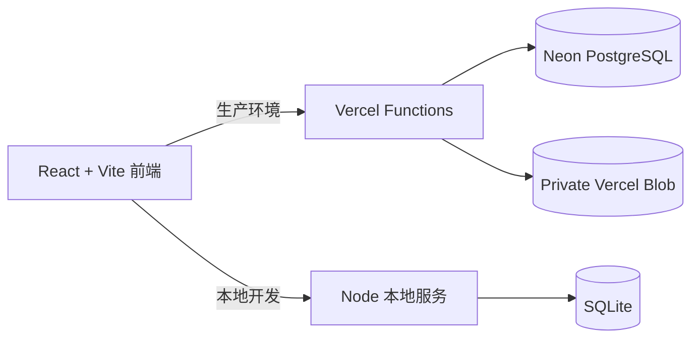

# 升级人生（LvlUpLife Reborn）

一个现代化、中文优先、单人使用的 [LvlUpLife](https://web.archive.org/web/20170604105300/http://lvluplife.com/) 开源替代品。

把现实生活中的行动变成 RPG 任务：接取一件真正想做的事，完成后留下文字、照片或附件，并获得经验、属性成长、等级解锁与连续记录。

> 当前状态：单人可用版，持续开发中。生产环境采用 Vercel + Neon PostgreSQL + Vercel Blob；本地开发采用 SQLite。

[在线使用](https://lvluplife.vercel.app/) · [原站架构考古](docs/original-architecture.md) · [验收截图](docs/research/current/README.md)


## 为什么重做 LvlUpLife

原版 LvlUpLife 最有价值的地方不是积分本身，而是给真实行动提供即时、可见的成就反馈：

1. 发现或接取一项现实任务。
2. 真正完成它，并遵守荣誉规则。
3. 写下过程，也可以上传图片或附件。
4. 获得经验和六项现实属性成长。
5. 升级并逐步发现更难、更稀有的成就。

本项目保留这一核心循环，并针对个人长期使用重新设计界面、中文内容、数据存储和隐私模型。目前不包含社区、好友、公共排行榜或多人账号系统。

## 已实现功能

### 挑战与任务

- 完整导入公开备份中的 538 项挑战，覆盖 18 个分类。
- 中文逐条翻译，并保留英文原文用于切换与溯源。
- 等级解锁、未知成就迷雾、下一批解锁等级和隐藏数量。
- 任务搜索、完整分类筛选、接取、退回、收藏和详情页。
- 可逆的“封印任务”：不想再看到的任务会退出推荐、列表、进行中和收藏，并可在封印库恢复。
- 真实浏览器路由，支持地址栏、后退、前进、直接打开和刷新任务详情。

### 成长机制

- 经验、等级进度条和升级反馈。
- 独立角色面板，集中展示等级、总经验、完成次数、连续天数、行动力和六项属性。
- 力量、文化、环境、魅力、才能、智慧六项现实属性。
- 每日、每周、每月、每年、终身一次五种重复周期与冷却。
- 行动力上限、每小时恢复和近期完成消耗。
- 连续完成天数、完成总数和最近战绩。
- 每个属性、等级经验和行动力规则均可在界面中查看说明。

### 完成记录

- 完成任务时记录最多 280 字的现实细节。
- 最多上传 3 个附件，单个文件不超过 10 MB。
- 支持 JPEG、PNG、WebP、GIF、PDF、Office、文本、Markdown 和 ZIP。
- 图片附件直接显示为大图预览，原文件可下载。
- 完成记录进入私人冒险日志和任务历史。
- 支持撤销完成记录，并同步回退经验、属性、冷却、等级和行动力。
- 撤销包含附件的记录时，会同时删除对应的私密 Blob 文件。

### 个性化与隐私

- 简体中文 / English 界面切换。
- 思源黑体、站酷快乐体、中文像素街机体和系统字体。
- 桌面端、平板和移动端响应式界面。
- 可安装 PWA，包含应用图标、快捷入口、Service Worker 和离线应用外壳。
- 单人访问密钥保护所有云端 API。
- Neon 保存进度和设置，Vercel Blob 私密存储附件。
- 封印、收藏、接取、完成记录和偏好设置均跨设备同步。

## 游戏规则

### 荣誉规则

应用不会替你判断现实中的行为是否真正发生。只有实际完成任务后，才应领取经验与属性奖励。

### 等级经验

- 等级 1 升到等级 2 需要 500 经验。
- 此后每一级所需经验增加 180。
- 升级会揭示更多挑战；等级不足的任务不会泄露名称和奖励。

### 重复周期

| 周期 | 再次获得奖励的等待时间 |
| --- | --- |
| 每日 | 1 天 |
| 每周 | 7 天 |
| 每月 | 30 天 |
| 每年 | 365 天 |
| 终身一次 | 只能获得一次奖励 |

### 六项属性

| 代码 | 属性 | 代表内容 |
| --- | --- | --- |
| STR | 力量 | 健康、体能、运动与身体行动 |
| CUL | 文化 | 艺术、历史、传统与开阔眼界 |
| ENV | 环境 | 家庭、户外、城市与周围世界 |
| CHA | 魅力 | 社交、表达、沟通与人际关系 |
| TAL | 才能 | 技能、创造力、专业能力与手作 |
| INT | 智慧 | 学习、思考、研究与解决问题 |

## 页面与路由

| 地址 | 页面 |
| --- | --- |
| `/` | 营地首页、今日委托、等级摘要与最近战绩 |
| `/character` | 独立角色面板、等级进度与六项属性说明 |
| `/quests` | 任务公会、搜索、分类、迷雾与封印库 |
| `/quests/:id` | 任务详情、循环规则、操作与完成历史 |
| `/my-quests` | 已接取任务和收藏任务 |
| `/chronicle` | 私人冒险日志与撤销完成记录 |
| `/settings` | 语言、字体与数据存储状态 |

## 技术架构



| 层级 | 技术 |
| --- | --- |
| 前端 | React 19、TypeScript、Vite、Lucide Icons、Service Worker PWA |
| 生产 API | Vercel Functions |
| 生产数据库 | Neon PostgreSQL，单行 JSONB 私人存档 |
| 附件 | Private Vercel Blob，授权后代理读取与删除 |
| 本地服务 | Node.js HTTP Server |
| 本地数据库 | Node SQLite |
| 代码检查 | TypeScript、Oxlint、Vite production build |

主要数据流：

- `GET /api/bootstrap`：加载挑战、进度和界面设置。
- `PUT /api/save`：保存接取、收藏、封印与完成记录。
- `PUT /api/settings`：保存语言和字体。
- `POST /api/blob-upload`：授权客户端上传私密附件。
- `GET /api/attachment`：鉴权后读取附件。
- `POST /api/attachments-delete`：撤销记录时删除附件。

## 本地开发

### 环境要求

- Node.js 22 或更高版本。
- npm 10 或更高版本。

### 启动

```bash
git clone https://github.com/wind2sing/lvluplife.git
cd lvluplife
npm install
npm run dev
```

默认地址：

- 前端：<http://localhost:5173>
- SQLite API：<http://localhost:8787>
- SQLite 文件：`data/lvluplife.sqlite`

本地模式不会校验云端访问密钥，但前端仍会显示私人存档入口；输入任意非空本地密钥即可进入。

### 常用命令

```bash
npm run dev                 # Vite + SQLite 本地服务
npm run dev:cloud           # 使用 Vercel Functions 和云端环境变量
npm run build               # TypeScript + 生产构建
npm run lint                # Oxlint
npm start                   # 使用已构建的 dist 启动本地生产服务
npm run data:generate       # 重新生成应用挑战数据
npm run data:translate      # 挑战翻译辅助脚本
npm run data:migrate:neon   # 将本地 SQLite 进度迁移到 Neon
```

## 部署到 Vercel

### 1. 创建资源

1. 创建 Neon PostgreSQL 数据库。
2. 在 Vercel 创建 Private Blob Store。
3. 将 GitHub 仓库导入 Vercel。

### 2. 配置环境变量

| 变量 | 用途 |
| --- | --- |
| `DATABASE_URL` | Neon PostgreSQL 连接地址 |
| `PERSONAL_ACCESS_KEY` | 个人访问密钥，请使用足够长的随机字符串 |
| `BLOB_READ_WRITE_TOKEN` | Vercel Blob 读写令牌，连接 Blob Store 后通常自动注入 |
| `VERCEL_OIDC_TOKEN` | Vercel 集成在需要时自动提供 |

不要提交 `.env.local`、数据库文件或任何访问令牌；这些内容已在 `.gitignore` 中排除。

### 3. 构建与首次启动

- Build Command：`npm run build`
- Output Directory：`dist`
- Vercel Functions：`api/`
- SPA 路由重写：`vercel.json`

数据库表会在首次访问 API 时自动创建。首次云端初始化时，应用可以迁移旧浏览器中的 `lvluplife-save-v1` 本地进度。

## 项目数据与考古资料

| 路径 | 内容 |
| --- | --- |
| `data/original-challenges.txt` | 英文挑战完整备份 |
| `data/challenges-zh.json` | 逐条中文翻译 |
| `src/data/challenges.json` | 前端与 API 使用的挑战数据 |
| `docs/original-architecture.md` | 原版产品架构、解锁、冷却和信息架构考古 |
| `docs/research/screenshots/` | Wayback 原站截图 |
| `docs/research/current/` | 当前重制版验收截图 |

核心资料来源：

- [挑战列表完整备份](https://docs.google.com/document/d/1ji2-rvl26vksrx874wFnt8Ixs-zXcBKL/edit)
- [2017 年原站首页](https://web.archive.org/web/20170604105300/http://lvluplife.com/)
- [2016 年原站帮助页](https://web.archive.org/web/20160126233355/http://lvluplife.com/help)
- [Wayback 路由索引](https://web.archive.org/cdx/search/cdx?url=lvluplife.com/*)

LvlUpLife 名称、原始挑战和原站资料归各自权利人所有。本项目是非官方重制与个人学习项目。

## 下一步实现计划

路线图优先保证个人长期使用的数据可靠性，再扩展玩法。

### P0：可靠性与正式开源准备

- [ ] 增加明确的云存档状态：保存中、已同步、失败重试和最后同步时间。
- [ ] 为经验、升级、冷却、行动力、撤销、封印和路由增加自动化测试。
- [ ] 增加完整存档导出 / 导入，支持 JSON 备份与灾难恢复。
- [ ] 为存档结构增加版本号和自动迁移机制。
- [ ] 增加错误边界、API 错误提示和附件上传失败恢复。
- [ ] 选择并添加正式开源许可证；目前仓库尚未包含许可证。

### P1：核心玩法增强

玩法扩展遵循三个原则：奖励真实行动而不是点击次数；允许休息、退回和封印，不制造连续打卡焦虑；新增系统必须服务于个人长期使用，而不是堆叠无意义的货币和数值。

#### 1. 自定义任务系统

解决原始 538 项挑战无法覆盖个人工作、家庭和长期目标的问题。

最小可用版本：

- [ ] 创建、编辑、复制和封印自定义任务。
- [ ] 配置标题、说明、分类、等级、经验、属性奖励和重复周期。
- [ ] 设置完成标准与完成记录提示，例如“上传结果照片”或“写下三点复盘”。
- [ ] 支持“仅自己可见”的来源标识，与原版挑战区分。
- [ ] 根据等级和属性点上限校验奖励，避免自定义任务破坏成长曲线。

后续扩展：

- [ ] 自定义分类、图标和颜色。
- [ ] 从 JSON 导入 / 导出个人任务包。
- [ ] 提供“晨间习惯”“家庭维护”“学习计划”等本地模板包。

#### 2. 任务类型与组织方式

当前所有内容都表现为单个任务，后续可区分不同现实目标：

| 类型 | 用途 | 示例 |
| --- | --- | --- |
| 快速任务 | 5–30 分钟可完成的小行动 | 整理桌面、散步 20 分钟 |
| 习惯任务 | 按日、周、月循环 | 每周运动三次 |
| 里程碑 | 只能完成一次的重要节点 | 通过考试、完成一次演讲 |
| 愿望清单 | 不设期限的长期体验 | 去某个国家、学会潜水 |
| 任务链 | 必须依次完成的多步骤冒险 | 选题 → 学习 → 制作 → 发布 |
| 项目 | 包含多个可并行子任务 | 搬家、装修、制作个人网站 |

计划功能：

- [ ] 为任务增加预计时长、所需精力、地点和情境标签。
- [ ] 支持任务链的前置条件、步骤进度和阶段奖励。
- [ ] 支持项目总进度、子任务清单和项目完成总结。
- [ ] 愿望清单默认不进入每日推荐，避免长期目标占据当前行动区。

#### 3. 每日冒险板与每周委托

目标不是强迫每天清空列表，而是从大量挑战中给出少量、容易决策的候选行动。

- [ ] 每天生成 3 个候选任务：一个轻松任务、一个成长任务、一个自由选择位。
- [ ] 推荐时排除冷却、封印和最近频繁跳过的任务。
- [ ] 允许无惩罚换一批、稍后再做或直接封印。
- [ ] 可选择当天状态：低精力、普通、充沛，并据此调整推荐难度。
- [ ] 每周生成一个跨 2–5 步的主题委托，例如“恢复生活秩序”或“探索所在城市”。
- [ ] 完成整组委托后给予徽章、称号或外观收藏，不额外膨胀属性数值。

#### 4. 智能推荐与“为什么推荐”

推荐应当可理解、可纠正，而不是黑箱随机。

- [ ] 综合等级、收藏、最近完成分类、属性短板、冷却和封印记录排序。
- [ ] 显示推荐理由，例如“你最近较少提升环境属性”或“这是收藏已久的任务”。
- [ ] 提供“不适合我”“现在没条件”“已经会了”等反馈，并影响后续推荐。
- [ ] 区分永久封印和暂时搁置；搁置任务可在指定日期后重新出现。
- [ ] 支持按可用时间、地点和精力筛选，例如“在家，20 分钟，低精力”。

#### 5. 角色成长、专精与称号

六项属性目前只有累计数值，后续可以提供更有意义的阶段反馈。

- [ ] 每项属性拥有独立等级和里程碑，而不是只有无限增长的点数。
- [ ] 根据长期行为生成角色倾向，例如“城市探索者”“知识收藏家”“生活工匠”。
- [ ] 允许选择一个当前专精方向，但不限制完成其他类型任务。
- [ ] 专精奖励以推荐权重、界面装饰和称号为主，不制造必须刷取的数值优势。
- [ ] 支持六维雷达图、历史变化和阶段对比。

可增加的称号示例：

- 初次启程：完成第一个任务。
- 七日足迹：在七个不同日期留下完成记录。
- 六边形冒险者：六项属性都达到指定阶段。
- 归来仍是冒险者：间隔 30 天后重新完成一个任务。
- 长线主义者：完成持续一个月以上的任务链或项目。

#### 6. 徽章、收藏品与非数值奖励

为了保持“真实成就反馈”，奖励应优先成为纪念物，而不是可无限刷取的金币。

- [ ] 完成特殊条件后获得徽章、像素头像框、营地装饰或主题配色。
- [ ] 为终身成就生成独特纪念卡片，可包含日期、文字和照片。
- [ ] 每个自然月生成一张个人冒险封面，展示代表任务与主要属性。
- [ ] 允许把完成记录制作成可下载的私人成就卡，但默认不公开分享。
- [ ] 收藏品只影响外观，不出售、不抽卡、不引入付费数值。

#### 7. 完成记录与复盘

- [ ] 编辑完成记录的文字、日期和附件，而不必先撤销任务。
- [ ] 可为记录添加心情、难度感受和“是否值得再次做”。
- [ ] 每周营火复盘：自动汇总完成内容、属性变化、照片和一句自我评价。
- [ ] 每月回顾：本月代表成就、最常提升属性、被封印或长期搁置的目标。
- [ ] 从复盘中直接调整推荐偏好、创建后续任务或开启任务链。
- [ ] 支持全文搜索历史记录与附件名称。

#### 8. 连续记录与休息机制

连续天数应当记录生活节奏，而不是变成惩罚。

- [ ] 区分“活跃日”和“休息日”，主动休息不会显示失败或损失经验。
- [ ] 提供每周目标频率，例如一周活跃 3 天，而不是强制每天完成。
- [ ] 连续记录中断后保留历史最佳，不使用付费冻结或补签道具。
- [ ] 长期未使用后启动“重新启程”流程，只推荐一个很小的回归任务。

#### 9. 个人统计与成长地图

- [ ] 按天、周、月查看经验、完成次数和六项属性变化。
- [ ] 分类热力图：观察时间主要投入在哪些生活领域。
- [ ] 完成时段、预计时长与实际难度统计，帮助改进任务拆分。
- [ ] 循环任务坚持率、任务链完成率、收藏转化率和封印原因统计。
- [ ] 所有统计只在私人存档中计算，不上传公共分析平台。

#### 10. 玩法实施顺序

| 阶段 | 首要交付 | 完成标准 |
| --- | --- | --- |
| P1-A | 自定义任务 + 时间 / 精力 / 情境标签 | 能创建个人任务并正常接取、完成、循环、封印和同步 |
| P1-B | 每日冒险板 + 可解释推荐 | 首页稳定提供少量候选，可换一批并解释推荐原因 |
| P1-C | 任务链 + 项目 | 多步骤目标可保存进度、领取阶段奖励并生成总结 |
| P1-D | 每周复盘 + 历史搜索 | 能从完成记录形成周报，并快速找到过去的文字与图片 |
| P1-E | 属性阶段 + 称号 + 收藏品 | 成长反馈更丰富，但不影响基础经验平衡 |
| P1-F | 个人统计与月度冒险封面 | 能观察长期趋势并生成可保存的私人纪念物 |

优先推荐先实现 **P1-A 自定义任务** 和 **P1-B 每日冒险板**。前者解决内容与个人生活不完全匹配的问题，后者解决 538 项挑战带来的选择负担；两者对日常可用性的提升最大。

### P2：使用体验

- [x] 可安装 PWA、应用快捷入口和离线应用外壳。
- [ ] 离线只读存档，在断网时查看最近一次同步的任务和冒险日志。
- [ ] 图片灯箱、上传前压缩、EXIF 方向修正和更好的附件管理。
- [ ] 任务列表排序：推荐、等级、奖励、周期、最近接触。
- [ ] 键盘快捷键、焦点管理、屏幕阅读器和对比度优化。
- [ ] 深色主题细化，以及更多可切换的 RPG 视觉主题。
- [ ] 更新并自动生成桌面端、移动端验收截图。

### 暂不优先

- 好友、社区动态、公开排行榜。
- 强制打卡提醒或惩罚机制。
- 多租户账号系统。

这些功能会显著扩大隐私、审核和运维范围；在单人体验和数据可靠性稳定前，不作为近期目标。

## 贡献

欢迎提交 Issue 或 Pull Request，尤其是：

- 原站玩法与页面的 Wayback 考古证据。
- 挑战翻译、分类、等级或重复周期修正。
- 移动端、可访问性和数据可靠性改进。
- 不破坏单人隐私模型的新玩法建议。

提交前请运行：

```bash
npm run build
npm run lint
```

## 许可证

项目暂未添加正式开源许可证。在许可证确定前，代码可公开查看，但不代表已授予复制、修改或再分发权限。正式发布前应优先完成许可证选择。
