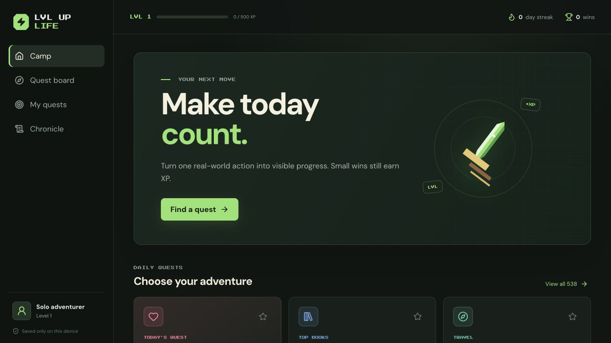

# 升级人生（LvlUpLife Reborn）

一个现代化、中文优先、单人使用的 [LvlUpLife](https://web.archive.org/web/20170604105300/http://lvluplife.com/) 开源替代品。

把现实行动变成 RPG 任务：接取真正想做的事，完成后留下文字、照片或附件，并获得经验、属性成长、等级解锁与纪念收藏。

> 当前状态：单人可用版，持续开发中。生产环境使用 Vercel + Neon PostgreSQL + Vercel Blob；本地开发使用 SQLite。

[在线使用](https://lvluplife.vercel.app/) · [玩法说明](docs/gameplay.md) · [开发与部署](docs/development.md) · [路线图](docs/roadmap.md) · [原站考古](docs/original-architecture.md)



## 核心功能

- 完整导入并中文化原版 538 项挑战，覆盖 18 个分类。
- 通过等级与迷雾逐步解锁任务，支持搜索、分类、收藏、接取、退回和封印。
- 支持每日、每周、每月、每年和终身一次任务，以及冷却和撤销完成。
- 自定义任务、任务链与项目，奖励可自动计算或手动调整。
- 完成时可填写记录并上传图片、文档或其他附件。
- 经验、等级、行动力和力量、文化、环境、魅力、才能、智慧六项属性。
- 每日冒险板、可解释推荐、七日复盘、长期统计和月度冒险封面。
- 私人称号、徽章、头像框、营地主题、纪念物与 PNG 纪念卡。
- 中文 / English、多种中文字体、响应式界面和可安装 PWA。
- 全局开关可关闭个人创作功能或私人收藏馆，关闭不会删除数据。
- 单人访问密钥保护云存档；正式环境附件保存于 Private Vercel Blob。

详细规则见 [玩法说明](docs/gameplay.md)。

## 快速开始

环境要求：Node.js 22+、npm 10+。

```bash
git clone https://github.com/wind2sing/lvluplife.git
cd lvluplife
npm install
npm run dev
```

- 前端：<http://localhost:5173>
- SQLite API：<http://localhost:8787>
- 本地数据库：`data/lvluplife.sqlite`

常用命令：

```bash
npm run dev              # 前端 + SQLite 服务
npm run build            # TypeScript + 生产构建
npm run lint             # 代码检查
npm run reward:validate  # 验证奖励规则
npm start                # 运行已构建版本
```

完整的本地开发、数据迁移和 Vercel 部署说明见 [开发与部署](docs/development.md)。

## 技术栈

| 层级 | 技术 |
| --- | --- |
| 前端 | React 19、TypeScript、Vite、Lucide、PWA |
| 生产 API | Vercel Functions |
| 生产数据 | Neon PostgreSQL + Private Vercel Blob |
| 本地服务 | Node.js HTTP Server + SQLite |
| 检查 | TypeScript、Oxlint、Vite production build |

## 核心资料

- [挑战列表完整备份](https://docs.google.com/document/d/1ji2-rvl26vksrx874wFnt8Ixs-zXcBKL/edit)
- [2017 年原站首页](https://web.archive.org/web/20170604105300/http://lvluplife.com/)
- [原版产品架构考古](docs/original-architecture.md)
- [当前版本验收截图](docs/research/current/README.md)

LvlUpLife 名称、原始挑战和原站资料归各自权利人所有。本项目是非官方重制与个人学习项目。

## 贡献

欢迎提交 Issue 或 Pull Request。提交前请运行：

```bash
npm run build
npm run lint
```

## 许可证

项目暂未添加正式开源许可证。在许可证确定前，代码可公开查看，但不代表已授予复制、修改或再分发权限。
