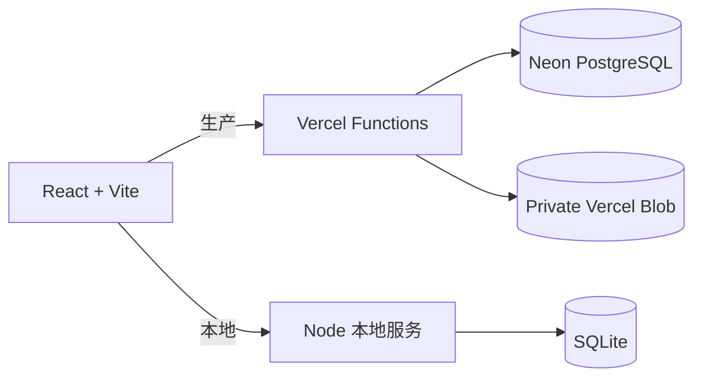

# 开发、数据与部署

## 架构



生产环境将单人存档保存在 Neon 的 JSONB 中，附件保存在 Private Vercel Blob。本地开发使用 SQLite。

## 本地开发

```bash
git clone https://github.com/wind2sing/lvluplife.git
cd lvluplife
npm install
npm run dev
```

- 前端：<http://localhost:5173>
- SQLite API：<http://localhost:8787>
- SQLite 文件：`data/lvluplife.sqlite`

本地模式不校验云端密钥，输入任意非空本地密钥即可进入。

## 命令

```bash
npm run dev                 # Vite + SQLite 本地服务
npm run dev:cloud           # Vercel Functions 本地环境
npm run build               # TypeScript + 生产构建
npm run lint                # Oxlint
npm start                   # 使用 dist 启动本地生产服务
npm run data:generate       # 重新生成挑战数据
npm run data:translate      # 翻译辅助脚本
npm run data:migrate:neon   # SQLite 进度迁移到 Neon
npm run reward:validate     # 验证奖励随精力和周期变化
```

## 生产 API

| 接口 | 用途 |
| --- | --- |
| `GET /api/bootstrap` | 加载挑战、进度和设置 |
| `PUT /api/save` | 保存任务状态、计划、收藏和完成记录 |
| `PUT /api/settings` | 保存语言、字体和功能开关 |
| `POST /api/blob-upload` | 授权上传私密附件 |
| `GET /api/attachment` | 鉴权读取附件 |
| `POST /api/attachments-delete` | 删除撤销记录的附件 |

## 部署到 Vercel

1. 创建 Neon PostgreSQL 数据库。
2. 在 Vercel 创建 Private Blob Store。
3. 将 GitHub 仓库导入 Vercel。
4. 配置环境变量：

| 变量 | 用途 |
| --- | --- |
| `DATABASE_URL` | Neon 连接地址 |
| `PERSONAL_ACCESS_KEY` | 足够长的个人访问密钥 |
| `BLOB_READ_WRITE_TOKEN` | Vercel Blob 令牌 |
| `VERCEL_OIDC_TOKEN` | Vercel 集成按需提供 |

- Build Command：`npm run build`
- Output Directory：`dist`
- Functions：`api/`
- SPA 路由：`vercel.json`

数据库表会在首次访问 API 时自动创建。不要提交 `.env.local`、数据库文件或访问令牌。

## 数据和考古资料

| 路径 | 内容 |
| --- | --- |
| `data/original-challenges.txt` | 英文挑战备份 |
| `data/challenges-zh.json` | 中文翻译 |
| `src/data/challenges.json` | 应用挑战数据 |
| `docs/original-architecture.md` | 原站产品架构考古 |
| `docs/research/screenshots/` | Wayback 原站截图 |
| `docs/research/current/` | 当前版本验收截图 |
